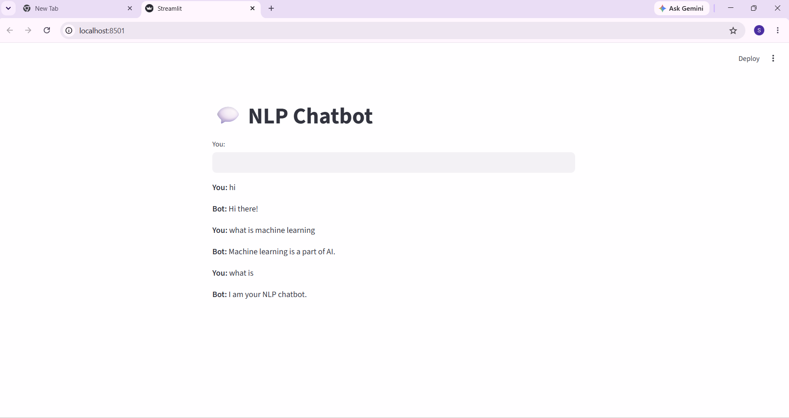

# nlp-chatbot-project
# 💬 NLP Chatbot Project

## 📌 Overview

This project is a simple NLP-based chatbot built using Python. It uses TF-IDF vectorization and cosine similarity to understand user queries and provide relevant responses.

---

## 🚀 Features

* Rule-based and NLP-based chatbot
* TF-IDF for text vectorization
* Cosine similarity for response matching
* Interactive web UI using Streamlit
* Session-based chat history

---

## 🛠️ Tech Stack

* Python
* NLTK
* Scikit-learn
* Streamlit

---

## ▶️ How to Run Locally

```bash
pip install -r requirements.txt
streamlit run app.py
```

---

## 🌐 Live Demo

(Add your Streamlit link here after deployment)

---

## 📷 Screenshots



---

## 💡 Future Improvements

* Add larger dataset
* Improve NLP accuracy
* Integrate advanced models (Hugging Face)
* Add better UI design

---

## 👨‍💻 Author

Sai
